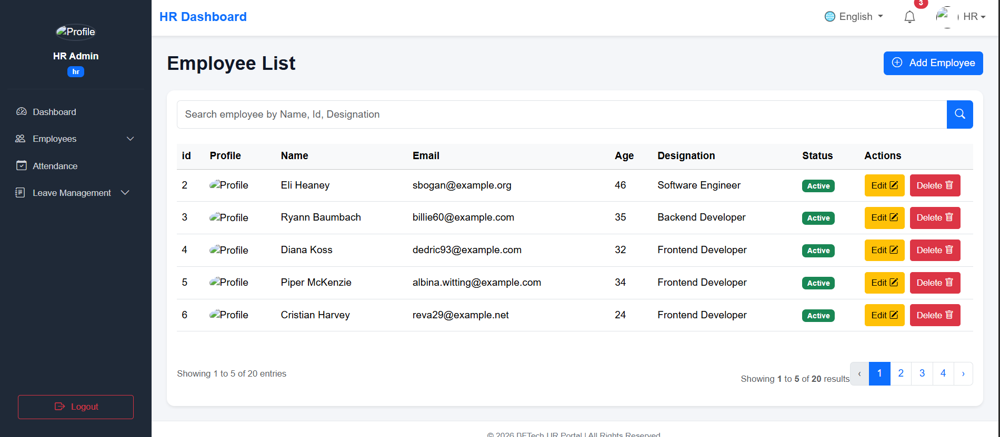
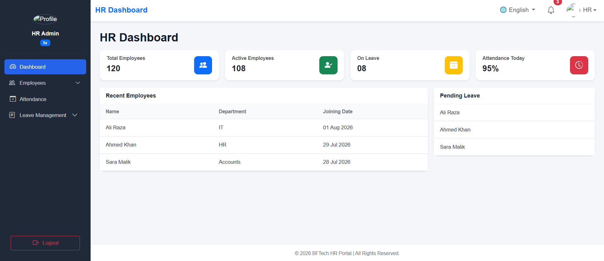

---

# BFTech HR Portal

A Laravel-based Human Resource Management System (HRMS) developed as part of my Laravel Development Internship. This project focuses on managing employee and HR operations including authentication, employee management, attendance tracking, leave management, multilingual support, and role-based access control.

---

# Project Overview

BFTech HR Portal is designed to simplify HR operations by providing separate Employee and HR Panels.

The project follows Laravel's MVC architecture and utilizes Form Requests, Sessions, Localization, Blade Templates, Middleware, Eloquent ORM, and Role-Based Authentication.

---

# Features

## Authentication

* Employee Registration
* Employee Login
* HR Login
* Role-Based Login Redirection
* Logout
* Forgot Password
* OTP Verification
* Reset Password

---

## Employee Dashboard

* Welcome Card
* Attendance Status
* Check-In
* Check-Out
* Dashboard Statistics

---

## Employee Profile

* Personal Information
* Contact Information
* Designation Information
* Other Information
* Change Password
* Profile Image Upload
* Delete Profile Image

---

## Attendance Module

### Employee Side

* Check In
* Check Out
* Attendance History
* Daily Attendance Status

### HR Side

* View Employee Attendance
* Attendance Details
* Search Attendance
* Attendance Filtering
* Attendance Editing

---

## Leave Management

### Employee Side

* Apply Leave
* Leave Validation
* Leave History
* Leave Status Tracking

### HR Side

* Total Leave Requests
* Pending Leave Requests
* Approved Leave Requests
* Rejected Leave Requests
* View Leave Details
* Approve Leave
* Reject Leave
* Leave Search Interface

---

## HR Portal

* HR Dashboard
* HR Navbar
* HR Sidebar
* HR Footer
* HR Profile Management
* Employee Management
* Employee Search
* Employee Details

---

## Localization

* English Language
* Urdu Language
* Dynamic Language Switching
* Validation Translation

---
# Screenshots

## Login Page


---

## Register Page


---

## Employee Dashboard


---

## Employee List



---

## HR Dashboard


---

# Technologies Used

## Backend

* Laravel
* PHP

## Database

* MySQL

## Frontend

* HTML5
* CSS3
* Bootstrap 5
* JavaScript
* Blade Templates

## Tools

* Composer
* Git
* GitHub
* VS Code

---

# Laravel Concepts Implemented

* MVC Architecture
* Routing
* Controllers
* Middleware
* Blade Layouts
* Blade Components
* Form Requests
* Validation
* Sessions
* Localization
* View Composer
* File Upload
* Password Hashing
* Eloquent ORM
* Eloquent Relationships
* Pagination
* Query Builder
* CRUD Operations
* Role-Based Authentication

---

# Installation

```bash
git clone https://github.com/FhussainCodes/BFTech_HR_Portal.git
```

```bash
cd BFTech_HR_Portal
```

```bash
composer install
```

```bash
cp .env.example .env
```

Configure database credentials inside the `.env` file.

```bash
php artisan key:generate
```

```bash
php artisan migrate
```

```bash
php artisan serve
```

---

# Folder Structure

```text
app/
bootstrap/
config/
database/
public/
resources/
routes/
storage/
```

---

# Recent Updates

## Authentication

* Added role column in Register table.
* Implemented Employee / HR Role-Based Login.
* Created custom HrAuth middleware.

## HR Portal

* Designed HR Dashboard Layout.
* Created HR Navbar.
* Created HR Sidebar.
* Created HR Footer.
* Developed HR Profile Module.
* Added Profile Image Upload/Delete.
* Implemented Employee Management Module.
* Implemented Employee Search.

## Attendance Module

* HR Attendance Listing.
* Attendance Details Page.
* Attendance Editing.
* Attendance Search Interface.
* Attendance Filtering.
* Employee-HR Attendance Workflow.

## Leave Management

* HR Leave Dashboard.
* Pending Leave Requests.
* Approved Leave Requests.
* Rejected Leave Requests.
* Leave Details Page.
* Leave Approval Workflow.
* Leave Rejection Workflow.
* Employee Relationship Integration.

---

# Future Improvements

* Attendance Reports
* Excel Attendance Import
* Employee Excel Import
* Notification Module
* Role & Permission Management
* Dashboard Charts
* PDF Reports
* Excel Export
* Activity Logs
* Email Notifications

---

# Learning Outcomes

During this project I learned:

* Laravel MVC Architecture
* Authentication & Authorization
* Middleware
* Form Request Validation
* Sessions
* Localization
* Blade Components
* CRUD Development
* Query Builder
* Pagination
* Eloquent Relationships
* Role-Based Authentication
* Attendance Management Logic
* Leave Approval Workflow
* File Upload
* Debugging
* Problem Solving

---

# Author

**Farrukh Hussain**

Laravel Development Intern

University of Education, Lahore

---

```
# Project Status

| Module | Status |
|---------|--------|
| Authentication | ✅ Completed |
| Employee Profile | ✅ Completed |
| Employee Management | ✅ Completed |
| Attendance Module | ✅ Completed |
| Leave Management | ✅ Completed |
| HR Dashboard | ✅ Completed |
| Localization | 🚧 In Progress |
| Notification System | ⏳ Pending |
| Reports | ⏳ Pending |
```

