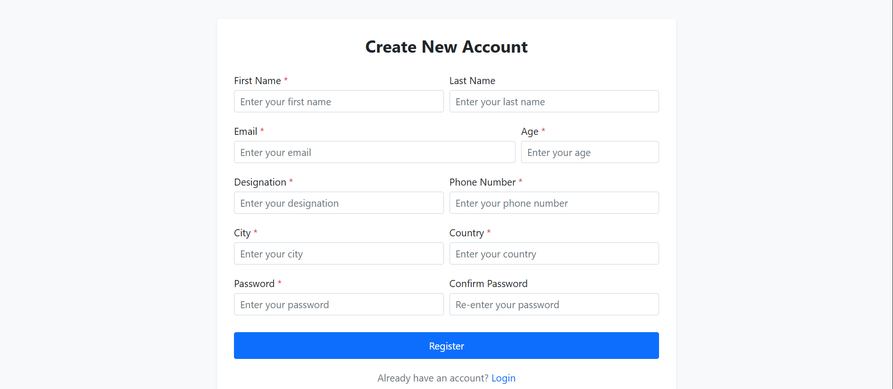
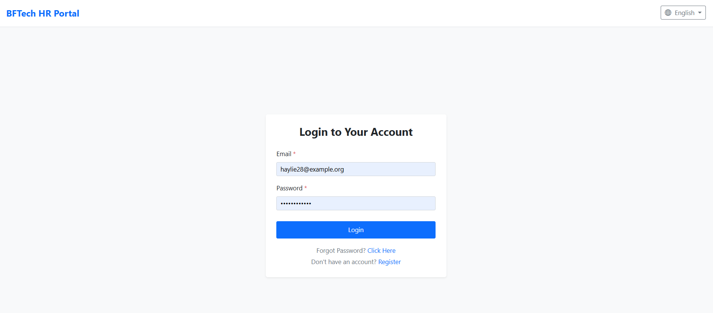
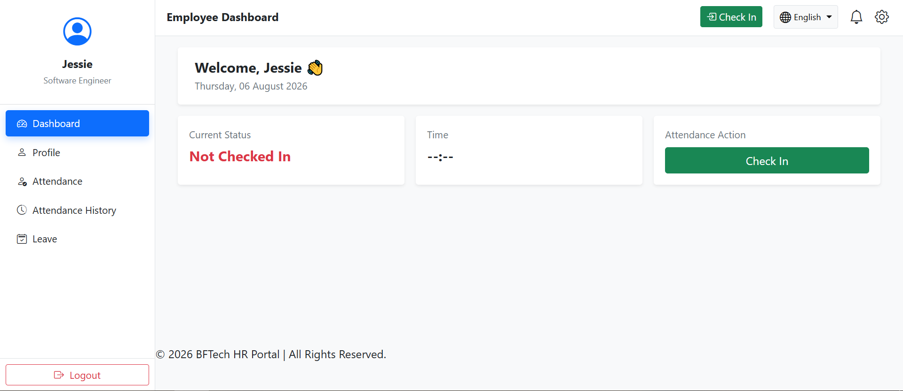
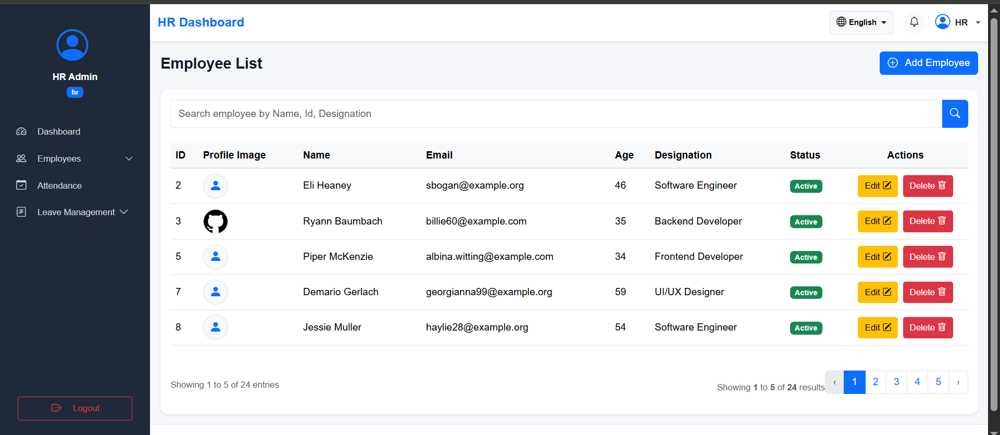
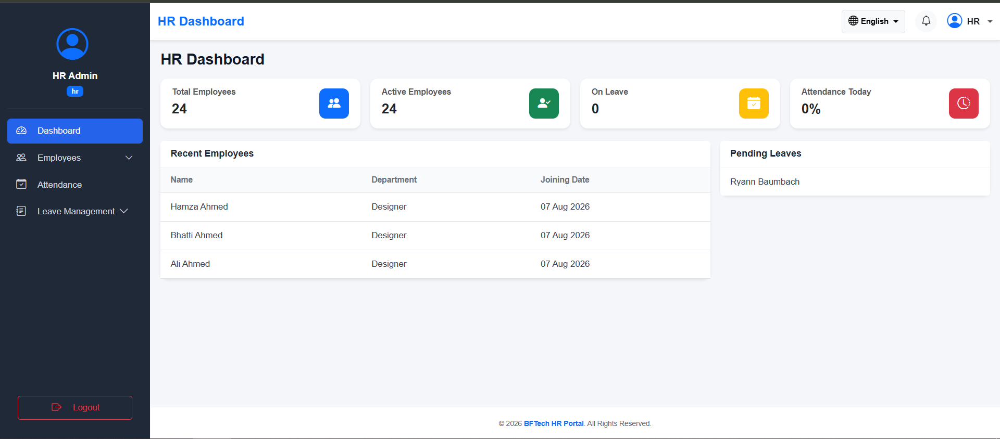

# BFTech HR Portal

A Laravel-based Human Resource Management System (HRMS) developed as part of my Laravel Development Internship. This project focuses on managing employee and HR operations including authentication, employee management, attendance tracking, leave management, Excel-based employee import, notifications, multilingual support, and role-based access control.

---

# Project Explanation

BFTech HR Portal is a Human Resource Management System designed to manage common employee and HR operations through separate Employee and HR panels.

The Employee Panel allows employees to manage their profiles, mark attendance, apply for leaves, view attendance history, and track leave status.

The HR Panel allows HR users to manage employees, monitor attendance, process leave requests, search and filter employee records, and view important HR-related information through the dashboard.

The application was developed using Laravel's MVC architecture and makes use of Form Requests, Sessions, Middleware, Localization, Blade Templates, Eloquent ORM, Query Builder, Database Relationships, Notifications, File Uploads, and Role-Based Access Control.

---

# Features

## Authentication

- Employee Registration
- Employee Login
- HR Login
- Role-Based Login Redirection
- Logout
- Forgot Password
- OTP Verification
- Reset Password
- Session Management
- Password Hashing

---

## Employee Dashboard

- Welcome Card
- Current Attendance Status
- Check-In
- Check-Out
- Attendance Statistics
- Dashboard Cards
- Leave Status Information

---

## Employee Profile

- Personal Information
- Contact Information
- Designation Information
- Other Information
- Change Password
- Profile Image Upload
- Profile Image Delete
- Profile Information Update
- Form Request Validation

---

## Attendance Module

### Employee Side

- Check-In
- Check-Out
- Attendance History
- Daily Attendance Status
- Dashboard Attendance Integration

### HR Side

- View Employee Attendance
- Attendance Details
- Attendance Search
- Attendance Filtering
- Attendance Editing

---

## Leave Management

### Employee Side

- Apply Leave
- Leave Validation
- Leave History
- Leave Status Tracking
- Leave Type Selection

### HR Side

- Total Leave Requests
- Pending Leave Requests
- Approved Leave Requests
- Rejected Leave Requests
- View Leave Details
- Approve Leave
- Reject Leave
- Edit Leave
- Delete Leave
- Employee Search
- Leave Type Search
- Status Search
- Date-Based Search
- Combined Search and Filtering

---

## HR Portal

- HR Dashboard
- HR Navbar
- HR Sidebar
- HR Footer
- HR Profile Management
- Employee Management
- Employee Search
- Employee Details
- Employee Edit
- Employee Delete
- Employee Excel Import
- HR Leave Management
- HR Attendance Management

---

## Employee Excel Import

The HR Panel provides an Excel-based employee import functionality.

HR users can upload an Excel file containing employee information and import multiple employee records into the database.

The import process includes:

- Excel File Upload
- Heading Row Support
- Employee Data Mapping
- Validation
- Duplicate Email Checking
- Password Hashing
- Role Assignment
- Database Record Creation
- Import Error Handling

---

## Notifications

A notification system has been implemented for employee leave applications.

When an employee applies for a leave:

1. The HR user receives a notification.
2. The notification count is displayed in the HR navbar.
3. HR can view the notification.
4. After viewing/reading the notification, the unread count is updated.
5. Clicking the notification can take HR to the relevant leave management page.

---

## Localization

The application supports multiple languages:

- English
- Urdu

Implemented features:

- Dynamic Language Switching
- Translation Files
- Validation Message Translation
- Locale Middleware
- Employee-side Localization
- HR-side Localization

---

# Screenshots

## Register Page



---


## Login Page



---

## Employee Dashboard



---

## Employee List



---

## HR Dashboard



---

<!-- ## Leave Management


---

## Attendance Management

 -->

# Technologies Used

## Backend

- Laravel
- PHP

## Database

- MySQL

## Frontend

- HTML5
- CSS3
- Bootstrap 5
- JavaScript
- Blade Templates

## Tools

- Composer
- Git
- GitHub
- VS Code
- Postman

---

# Laravel Concepts Implemented

- MVC Architecture
- Laravel Request Lifecycle
- Routing
- Named Routes
- Reverse Routing
- Route Groups
- Controllers
- Middleware
- Route Protection
- Blade Templates
- Blade Layouts
- Blade Partials
- Blade Components
- Form Requests
- Validation
- Custom Validation Messages
- Sessions
- Cookies
- Cache
- Localization
- View Composer
- File Upload
- Password Hashing
- Eloquent ORM
- Eloquent Relationships
- Query Builder
- Raw SQL
- CRUD Operations
- Pagination
- Excel Import
- Notifications
- Mail Configuration
- Jobs
- Events and Listeners
- Service Providers
- Policies
- Enums
- Traits
- Namespaces
- API Responses
- AJAX
- OOP Concepts
- Function Signatures
- PHP Array Functions
- foreach Loops
- Git and GitHub

---

# Installation

Clone the repository:

```bash
git clone https://github.com/FhussainCodes/BFTech_HR_Portal.git
````

Navigate to the project directory:

```bash
cd BFTech_HR_Portal
```

Install PHP dependencies:

```bash
composer install
```

Create the environment file:

```bash
cp .env.example .env
```

Configure the database credentials inside the `.env` file.

Generate the application key:

```bash
php artisan key:generate
```

Run database migrations:

```bash
php artisan migrate
```

Create the storage link if required:

```bash
php artisan storage:link
```

Start the Laravel development server:

```bash
php artisan serve
```

---

# Folder Structure

```text
BFTech_HR_Portal/
│
├── app/
│   ├── Http/
│   │   ├── Controllers/
│   │   │   ├── HR/
│   │   │   └── Auth/
│   │   ├── Middleware/
│   │   └── Requests/
│   ├── Imports/
│   ├── Mail/
│   ├── Models/
│   ├── Notifications/
│   └── Providers/
│
├── bootstrap/
├── config/
├── database/
│   ├── factories/
│   ├── migrations/
│   └── seeders/
│
├── lang/
│   ├── en/
│   └── ur/
│
├── public/
├── resources/
│   ├── css/
│   ├── js/
│   └── views/
│       ├── auth/
│       ├── emails/
│       ├── employee/
│       ├── hr/
│       ├── layouts/
│       ├── leave/
│       └── partials/
│
├── routes/
├── screenshots/
├── storage/
├── tests/
├── vendor/
├── .env
├── .env.example
├── .gitattributes
├── .gitignore
├── artisan
├── composer.json
├── composer.lock
├── package.json
├── phpunit.xml
├── README.md
└── vite.config.js
```

---

# Project Architecture

The project follows the Laravel MVC architecture.

### Model

Models are responsible for interacting with database tables and handling database-related operations using Eloquent ORM.

### View

Blade templates are used to create the application's user interface, layouts, components, forms, dashboards, and tables.

### Controller

Controllers handle application requests, execute business logic, communicate with models, and return appropriate views or responses.

### Middleware

Middleware is used for request filtering and route protection, including HR-specific access control and localization.

### Form Requests

Laravel Form Requests are used to keep validation rules organized and separate from controller logic.

---

# Recent Updates

## Authentication

* Added role column in Register table.
* Implemented Employee / HR role-based login.
* Implemented role-based redirection.
* Created custom HrAuth middleware.
* Implemented route protection.

## HR Portal

* Designed HR Dashboard Layout.
* Created HR Navbar.
* Created HR Sidebar.
* Created HR Footer.
* Developed HR Profile Module.
* Added Profile Image Upload/Delete.
* Implemented Employee Management Module.
* Implemented Employee Search.
* Implemented Employee Edit/Delete.
* Implemented Employee Excel Import.

## Attendance Module

* Implemented HR Attendance Listing.
* Created Attendance Details Page.
* Implemented Attendance Editing.
* Implemented Attendance Search.
* Implemented Attendance Filtering.
* Integrated Employee-HR Attendance Workflow.
* Integrated Attendance Statistics with Dashboard.

## Leave Management

* Developed HR Leave Dashboard.
* Implemented Pending Leave Requests.
* Implemented Approved Leave Requests.
* Implemented Rejected Leave Requests.
* Created Leave Details Page.
* Implemented Leave Approval Workflow.
* Implemented Leave Rejection Workflow.
* Implemented Leave Search and Filtering.
* Implemented Employee Leave Notifications.

## Localization

* Implemented English Localization.
* Implemented Urdu Localization.
* Added Employee-side Localization.
* Added HR-side Localization.
* Added Validation Message Translation.
* Implemented Dynamic Language Switching.

---

# Future Improvements

Although the core application has been completed, the following features can be considered for future development:

* Admin Dashboard
* Advanced Role and Permission Management
* Attendance Reports
* PDF Reports
* Excel Export
* Dashboard Charts and Analytics
* Activity Logs
* Advanced Email Notification Workflows
* Two-Factor Authentication
* Automated Testing
* Database Query Optimization
* Advanced Application Security
* Production Deployment

---

# Learning Outcomes

During the development of this project, I gained practical experience in:

* Laravel MVC Architecture
* Authentication and Authorization
* Middleware
* Form Request Validation
* Sessions and Cookies
* Localization
* Blade Templates and Components
* CRUD Development
* Eloquent ORM
* Query Builder
* Raw SQL
* Database Relationships
* Pagination
* Excel Import
* Notifications
* File Upload
* Route Protection
* Attendance Management Logic
* Leave Approval Workflow
* Debugging
* Problem Solving
* Git and GitHub

---

# Project Status

| Module                | Status      |
| --------------------- | ----------- |
| Authentication        | ✅ Completed |
| Employee Dashboard    | ✅ Completed |
| Employee Profile      | ✅ Completed |
| Employee Management   | ✅ Completed |
| Employee Excel Import | ✅ Completed |
| Attendance Module     | ✅ Completed |
| Leave Management      | ✅ Completed |
| HR Dashboard          | ✅ Completed |
| HR Profile            | ✅ Completed |
| Notifications         | ✅ Completed |
| Localization          | ✅ Completed |
| Route Protection      | ✅ Completed |
| Search & Filtering    | ✅ Completed |

---

# Project Repository

**GitHub Repository:**

[https://github.com/FhussainCodes/BFTech_HR_Portal](https://github.com/FhussainCodes/BFTech_HR_Portal)

---

# Author

**Farrukh Hussain**

Laravel Development Intern

BFTech HR Portal

---

# Project Status

The BFTech HR Portal has been successfully completed as part of my Laravel Development Internship. The project provided practical experience in developing a complete Laravel-based HR management system with separate Employee and HR panels.

